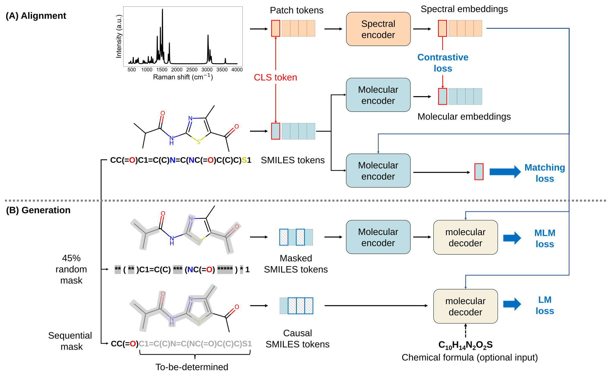

# Vib2Mol: from vibrational spectra to molecular structures—a versatile deep learning model
[](https://arxiv.org/abs/2503.07014)
[](https://huggingface.co/xinyulu/vib2mol)
[](https://huggingface.co/datasets/xinyulu/vibench)
[](https://doi.org/10.6084/m9.figshare.28579832)

## Abstract
There will be a paradigm shift in chemical and biological research, to be enabled by autonomous, closed-loop, real-time self-directed decision-making experimentation. Spectrum-to-structure correlation, which is to elucidate molecular structures with spectral information, is the core step in understanding the experimental results and to close the loop. However, current approaches usually divide the task into either database-dependent retrieval and database-independent generation and neglect the inherent complementarity between them. In this study, we proposed Vib2Mol, a versatile deep learning model designed to flexibly handle diverse spectrum-to-structure tasks according to the available prior knowledge by bridging the retrieval and generation. It not only achieves state-of-the-art performance in analyzing theoretical Infrared and Raman spectra, but also outperform previous models at experimental data. Moreover, Vib2Mol demonstrates promising capabilities in predicting reaction products and sequencing peptides, enabling vibrational spectroscopy a real-time guide for autonomous scientific discovery workflows.

# Framework of Vib2Mol 

> The framework of Vib2Mol for pretraining.

## Datasets and Checkpoints
We provide the datasets and checkpoints in the following links:
heckpoints
All checkpoints are available in the [Hugging Face](https://huggingface.co/xinyulu/vib2mol).  
All datasets are available in [Hugging Face](https://huggingface.co/datasets/xinyulu/vibench) and [figshare](https://doi.org/10.6084/m9.figshare.28579832). There are test sets only, and we will release the training and validation sets upon acceptance of the paper.

You can download the datasets and checkpoints from the links above, or employ huggingface-cil by following codes:
```bash
# download datasets
hf download xinyulu/vibench --repo-type=dataset --local-dir ./datasets/vibench
# download checkpoints
hf download xinyulu/vib2mol --local-dir ./
```


## Getting Started
```python
pip install -r requirements.txt

# start to train
python main.py \
-train \
--launch matching \
--model vib2mol \
--ds mols \
--task raman-kekule_smiles


# fine-tuning with ddp
torchrun \
--nproc_per_node=4 \
main.py \
-train \
--ddp \
--launch spt \
--model vib2mol \
--ds mols \
--task ir-raman-kekule_smiles-formula \
--smiles_augment \
--base_model_path 'path/to/your/checkpoint'
```

## Evaluation
```bash
bash infer_retrieval.sh
# or
bash infer_lm.sh
```

## logs and tensorboard files
All logs and tensorboard files are saved in the `logs` and `runs` directories, respectively.
You can visualize the training process by tensorboard:
```bash
tensorboard --logdir ./runs
```

## Hardware
Four NVIDIA A800 GPUs were employed for experiments, while pretraining on VB-mols costs almost 85 hours (stage 1 for ~38 hours and stage 2 for ~48 hours).

## Citation
Cite our work as followes:
```
@article{lu2025vib2mol,
      title={Vib2Mol: from vibrational spectra to molecular structures-a versatile deep learning model}, 
      author={Xinyu Lu, Hao Ma, Hui Li, Jia Li, Tong Zhu, Guokun Liu, Bin Ren},
      year={2025},
      url={https://arxiv.org/abs/2503.07014}, 
}
```

## Acknowledgements
This work was supported by the National Natural Science Foundation (Grant No: 22227802, 22021001, 22474117 and 22272139) of China and the Fundamental Research Funds for the Central Universities (20720220009 and 20720250005) and Shanghai Innovation Institute.

## Contact
Welcome to contact us or raise issues if you have any questions. 
Email: xinyulu@stu.xmu.edu.cn