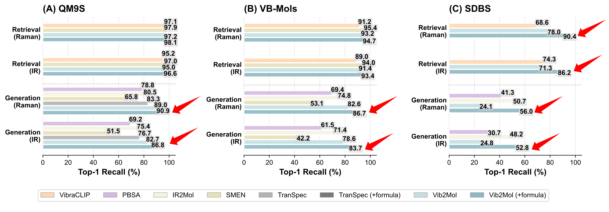

# Vib2Mol: from vibrational spectra to molecular structures — a unified deep learning framework

<p align="center">
  <a href="https://doi.org/10.1039/D6SC04559F"></a>
  <a href="https://huggingface.co/xinyulu/vib2mol"></a>
  <a href="https://huggingface.co/datasets/xinyulu/vibench"></a>
  <a href="https://doi.org/10.6084/m9.figshare.28579832"></a>
</p>

## Overview

**Vib2Mol** is a unified framework for molecular retrieval and generation from vibrational spectra, optionally conditioned on prior knowledge such as molecular formulas.

We recommend **Vib2Mol-MMM** as the default model. A single MMM model supports flexible inference from **IR, Raman, or IR + Raman spectra**, making it suitable for practical scenarios with different combinations of available spectral modalities.

<p align="center">
  
</p>

> We also developed **Vib2Conf** for retrieving molecular conformations from vibrational spectra, published in [*Analytical Chemistry*](https://doi.org/10.1021/acs.analchem.6c02845).

## Quick start

### Installation

```bash
python -m pip install -r requirements.txt

# Optional
python -m unittest discover -s scripts/tests -v
```

The reference environment uses PyTorch 2.7.0. GPU evaluation requires a compatible NVIDIA CUDA environment.

### Datasets and checkpoints

* **Dataset:** [ViBench](https://huggingface.co/datasets/xinyulu/vibench)
* **Checkpoints:** [Vib2Mol](https://huggingface.co/xinyulu/vib2mol)

```bash
hf download xinyulu/vibench \
    --repo-type=dataset \
    --local-dir ./datasets/vibench

hf download xinyulu/vib2mol \
    --local-dir ./checkpoints
```

### Vib2Mol-MMM

**Vib2Mol-MMM is the recommended model for inference.**

List available experiments:

```bash
python scripts/run_inference.py retrieval_mmm --list
python scripts/run_inference.py generation_mmm --list
```

MMM supports single- and dual-spectrum retrieval using the same model family, including:

* IR → molecule
* Raman → molecule
* IR + Raman → molecule
* IR + Raman + formula → molecule generation

For example, SDBS retrieval can be evaluated with:

```bash
python scripts/run_inference.py retrieval_mmm \
    --dataset sdbs \
    --device cuda:0 \
    --batch-size 32
```


See [`scripts/README.md`](scripts/README.md) for detailed evaluation options.

## Standard Vib2Mol

The original modality-specific **Vib2Mol** checkpoints are retained for reproducing the experiments reported in the paper.

```bash
python scripts/run_inference.py retrieval --list
python scripts/run_inference.py generation --list
```

Example:

```bash
CUDA_VISIBLE_DEVICES=0 \
python scripts/run_inference.py retrieval qm9s_ir \
    --device cuda:0 \
    --batch-size 32
```

Formula-conditioned generation:

```bash
CUDA_VISIBLE_DEVICES=0 \
python scripts/run_inference.py generation qm9s_ir_raman_formula \
    --device cuda:0 \
    --batch-size 32
```

For custom checkpoints and options:

```bash
python scripts/infer_retrieval.py --help
python scripts/infer_generation.py --help
```

## Training

Vib2Mol follows a two-stage training scheme:

1. **Spectrum–molecule alignment and matching**
2. **Molecular sequence generation**

Example Stage-1 training:

```bash
python main.py \
    --train \
    --launch matching \
    --model vib2mol \
    --ds mols \
    --task ir-raman-kekule_smiles
```

Example Stage-2 training:

```bash
torchrun --nproc_per_node=4 main.py \
    --train \
    --ddp \
    --launch spt \
    --model vib2mol \
    --ds mols \
    --task ir-raman-kekule_smiles-formula \
    --smiles-augment \
    --base-model-path path/to/stage1/epoch999.pth
```

See `config.yaml` and [`scripts/`](scripts/) for detailed configurations and evaluation workflows.

<details>
<summary><strong>Repository structure</strong></summary>

<br>

| Path               | Description                               |
| ------------------ | ----------------------------------------- |
| `models/`          | Vib2Mol and Vib2Mol-MMM models            |
| `trainers/`        | Training workflows                        |
| `utils/`           | Dataset and training utilities            |
| `scripts/`         | Inference and evaluation scripts          |
| `scripts/configs/` | Experiment manifests                      |
| `scripts/tests/`   | Regression tests                          |
| `notebooks/`       | Analysis and dataset-generation notebooks |
| `docs/`            | Figures and project assets                |
| `logs/`            | Original experiment logs                  |
| `runs/`            | TensorBoard records                       |

</details>

## Citation

If you find Vib2Mol useful, please cite:

```bibtex
@article{Lu2026Vib2Mol,
    author  = {Lu, Xinyu and Ma, Hao and Li, Hui and Li, Jia and Rong, Yi and Li, Yuqiang and Zhu, Tong and Liu, Guokun and Ren, Bin},
    title   = {Vib2Mol: from vibrational spectra to molecular structures—a unified deep learning framework},
    journal = {Chemical Science},
    year    = {2026},
    doi     = {10.1039/D6SC04559F},
    url     = {https://doi.org/10.1039/D6SC04559F}
}
```

## Acknowledgements

This work was supported by the National Natural Science Foundation of China (Grant Nos. 22227802, 22021001, 22474117, and 22272139), the Fundamental Research Funds for the Central Universities (20720220009 and 20720250005), and Shanghai Innovation Institute.

## Contact

**Xinyu Lu**
[xinyulu@stu.xmu.edu.cn](mailto:xinyulu@stu.xmu.edu.cn)
